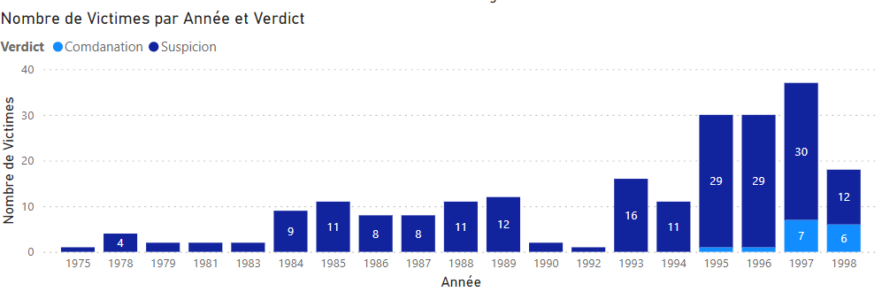
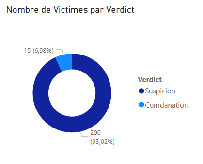
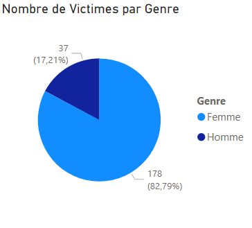
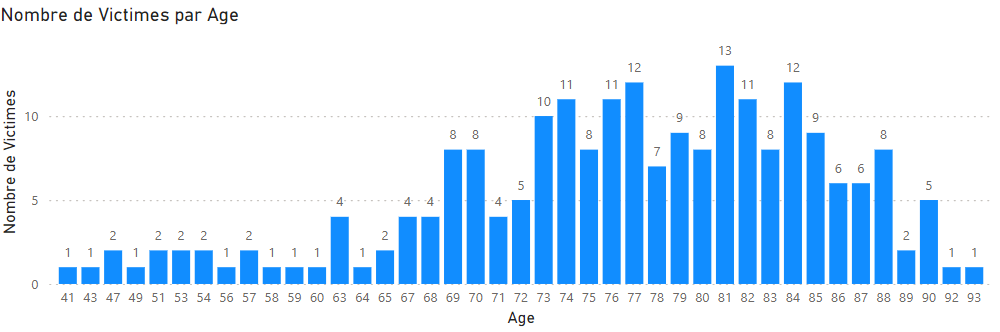
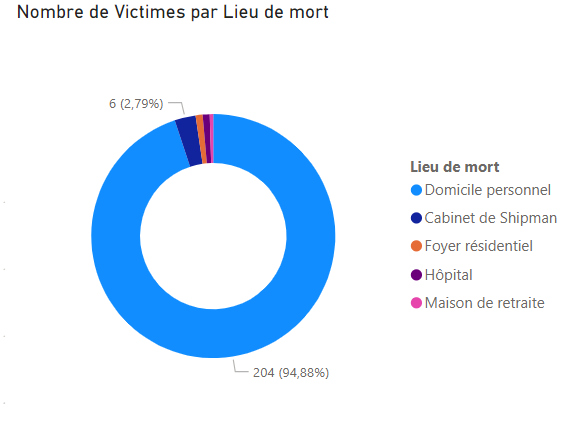
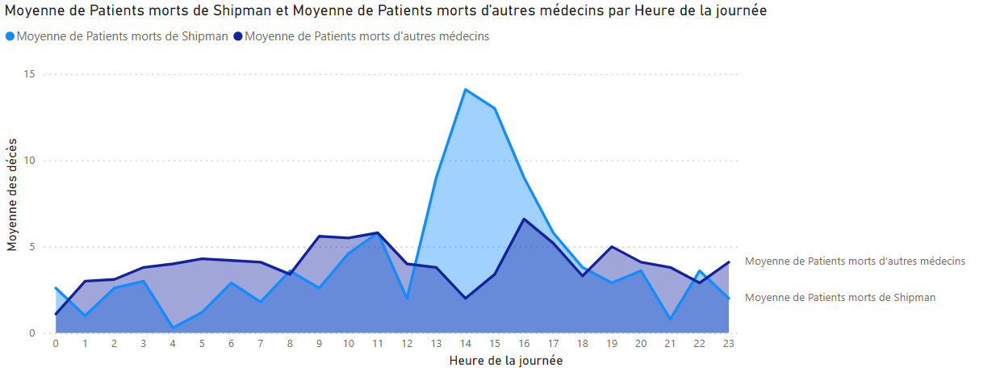

# Analyse des données des meurtres du Dr Shipman en utilisant PowerBI

## Table des matières

- [Analyse des données des meurtres du Dr Shipman en utilisant PowerBI](#analyse-des-données-des-meurtres-du-dr-shipman-en-utilisant-powerbi)
  - [Table des matières](#table-des-matières)
  - [L'équipe](#léquipe)
  - [Power BI](#power-bi)
    - [Fonctionnalités](#fonctionnalités)
    - [Prix](#prix)
  - [Dashboard](#dashboard)
    - [Avantages](#avantages)
    - [Inconvénients](#inconvénients)
    - [Fonctionnalités courantes](#fonctionnalités-courantes)
  - [Contexte](#contexte)
    - [Données](#données)
      - [shipman-confirmed-victims.csv](#shipman-confirmed-victimscsv)
      - [shipman-times-comparison.csv](#shipman-times-comparisoncsv)
    - [Problématique](#problématique)
  - [Analyse des données](#analyse-des-données)
    - [Dashboard](#dashboard-1)
    - [Quelques graphiques](#quelques-graphiques)
      - [Nombre de victimes par année, séparés par verdict](#nombre-de-victimes-par-année-séparés-par-verdict)
      - [Proportion des verdicts](#proportion-des-verdicts)
      - [Proportion des genres des victimes](#proportion-des-genres-des-victimes)
      - [Nombre de victimes par âge](#nombre-de-victimes-par-âge)
      - [Nombre de victimes par lieu du décès](#nombre-de-victimes-par-lieu-du-décès)
      - [Comparaison des heures de décès des patients du Dr Shipman avec d'autres médecins](#comparaison-des-heures-de-décès-des-patients-du-dr-shipman-avec-dautres-médecins)
  - [conclusion à la problématique](#conclusion-à-la-problématique)

## L'équipe
3 étudiants en 1ère année de Bachelor IT spécialité Intelligence Artificielle à [La Plateforme_](https://laplateforme.io/) à Marseille
- Bruno Coulet
  
  

- Ines Lorquet
  
  
- Christian Aucane
  
  

## Power BI

Power BI Desktop est un outil de visualisation de données puissant qui permet de créer, partager et analyser des rapports interactifs à partir de données.

Voici quelques informations importantes à propos de Power BI:
### Fonctionnalités
  - Connecter en toute sécurité à des centaines de sources de données (locales et cloud).
  - Transformer et combiner des données provenant de diverses sources.
  - Étendre des modèles de données à l’aide de formules DAX.
  - Choisir parmi plus de 100 visuels de données (seulement 42 pour la version gratuite) et créer ses propres graphiques.
  - Explorer en profondeur les données pour trouver des cohérences et tirer des enseignements.
  - Personnaliser la conception avec des outils de mise en forme et des thèmes intuitifs.
  - Créer des rapports mobiles pour les utilisateurs itinérants.
  - Partager l’analyse visuelle avec votre équipe en publiant sur le service web Power BI.
### Prix
  - **Power BI Desktop** : Gratuit
  - **Power BI Pro** : 8.4.€ / utilisateur / mois
  - **Microsoft 365 E5** : 56€ / utilisateur / mois
  - **Microsoft 365 Entreprise E5** : 34.40€ / utilisateur / mois

## Dashboard

Un dashboard est une représentation visuelle des informations importantes sur un même écran. Il permet de mesurer la performance d’une entreprise et d’évaluer son organisation en vue d’atteindre un ou plusieurs objectifs.

### Avantages
- Visualisation claire: Les dashboards présentent les données de manière concise et compréhensible, facilitant ainsi la prise de décisions.
- Suivi en temps réel: Ils permettent de suivre les indicateurs clés en temps réel, ce qui est essentiel pour réagir rapidement aux changements.
- Personnalisation: Vous pouvez personnaliser les dashboards pour répondre aux besoins spécifiques de votre entreprise.
- Centralisation des données: Les dashboards agrègent des informations provenant de différentes sources, offrant une vue d’ensemble complète.
  
### Inconvénients
- Complexité excessive: Si mal conçus, les dashboards peuvent devenir trop complexes et difficiles à interpréter.
- Surcharge d’informations: Trop d’informations sur un seul écran peuvent entraîner une surcharge cognitive.
- Dépendance aux données: Les dashboards sont aussi bons que les données qu’ils affichent. Des données incorrectes ou incomplètes peuvent fausser les analyses.
  
### Fonctionnalités courantes
- Graphiques et visualisations: Incluent des graphiques à barres, des camemberts, des courbes, etc.
- Filtres et paramètres: Permettent aux utilisateurs de personnaliser les vues.
- Alertes et notifications: Avertissement lorsque des seuils sont atteints.
- Intégration de données: Connexion à différentes sources de données.
- Tableaux de bord interactifs: Possibilité de creuser les données.

## Contexte

### Données
Les données fournies sont réparties en deux fichiers CSV (**C**omma **S**eparated **V**alues).
C'est un type de fichier texte dans lequel les différentes colonnes sont séparées par des virgules.

#### shipman-confirmed-victims.csv
Données concernant les victimes du Dr Harold Shipman
- `DateofDeath` : Date de l'assassinat
- `Name` : Nom de la victime
- `PlaceofDeath` : Lieu de la mort
  - **"Hospital"** : Mort a l'hôpital
  - **"Nursing home"** : Maison de repos
  - **"Own home"** : Domicile de la victime
  - **"Residential home"** : Foyer résidentiel
  - **"Shipman's surgery"** : Cabinet du Dr Shipman
- `Decision` : Verdict
  - **"Conviction"** : Reconnu coupable
  - **"Unlawful killing"** : Non condamné
- `yearOfDeath` : Année de l'assassinat
- `gender` : Genre en valeur numérique
  - **0** : Femme
  - **1** : Homme
- `FractionalDeathYear` : Année avec une virgule pour la précision (⚠️ **COLONNE FAUSSE** ⚠️ -> Ne correspond pas a la `DateofDeath`)
- `ageBracket` : Tranche d'âge de 5 ans
- `gender2` : Genre des victimes
  - **"Women"** : Femme
  - **"Men"** : Homme

#### shipman-times-comparison.csv
Données moyennes de l'heure à laquelle les patients d'Harold Shipman sont décédés, comparée à l'heure à laquelle les patients d'autres médecins généralistes locaux sont décédés.
- `Hour` : Heure de la mort (de 0 à 23)
- `Shipman` : Moyenne du nombre de décès des patients du Dr Shipman
- `Comparison` : Moyenne du nombre de décès d'autres médecins locaux

### Problématique

Nous devons analyser les données des 2 datasets fournis pour répondre aux question suivante :

- Quels types de personnes a-t-il assassinées?
- Quand sont-elles mortes ? 

## Analyse des données

### Dashboard

TODO : ajouter dashboard

### Quelques graphiques

#### Nombre de victimes par année, séparés par verdict

*Le dr Shipman a tué entre 1975 et 1998. Il a été condamné seulement pour des vicimes entre 1995 et 1998*
  
#### Proportion des verdicts

*Il a été comdamné seulement pour 15 victimes (6.98%)*

#### Proportion des genres des victimes

*Il a tué majoritairement des femmes (82.79%)*

#### Nombre de victimes par âge

*La majorité des victimes ont entre 65 et 90 ans*

#### Nombre de victimes par lieu du décès

*La majorité des victimes sont mortes a leur domicile (94.88%)*

#### Comparaison des heures de décès des patients du Dr Shipman avec d'autres médecins

*On voit clairement qu'entre 13h et 16h il y a plus de patients morts du Dr Shipman que des autres médecins*
  
## conclusion à la problématique